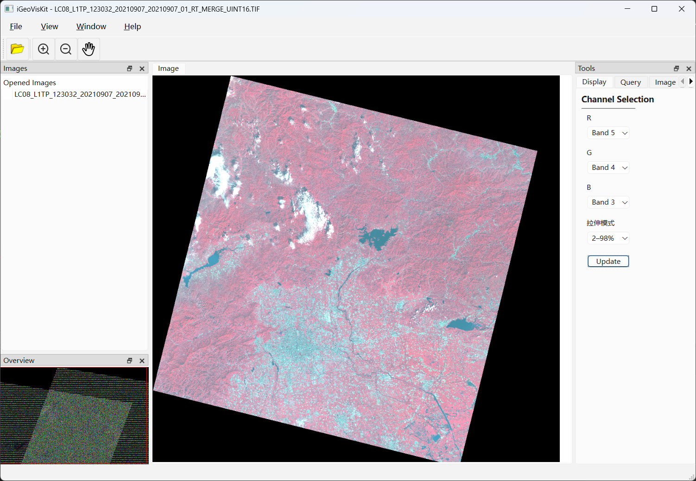

# iGeoVisKit

An open-source platform for the visualization and analysis of GIS data and remote sensing imagery(e.g. multispectral images and hyperspectral images from UAVs or satellites).



**Thanks:** This project is a derivative of Project (Parbat3D)[https://github.com/rowanj/Parbat3D] and draws heavy inspiration from it. Many thanks to the original authors for their excellent work.

## Development Envirement

| Requirements | Content                                      |
| -------- | ----------------------------------------- |
| Language | C++(std=c++17)                            |
| C++ Package Manager | vcpkg                            |
| IDE      | Visual Studio 2022                        |
| LIB      | Qt 6.8.3、GDAL、glm、glad |

## 🛠️ Compile and Run

- Configure and generate the C++ project files：

```sh
cmake --preset local-windows
```

- You can compile the program immediately using the following command."", and the open the iGeoVisKit.sln file.

```
cmake --build build/local-windows --config Debug
```

- Last, run the program:

```
.\build\local-windows\bin\Debug\iGeoVisKit.exe
```

**Note:**

- Alternatively, you can first navigate to the ./build/local-windows directory by running:

```sh
cd build/local-windows
```

- Then, double-click the iGeoVisKit.sln file to open the solution in Visual Studio, where you can build or debug the program.